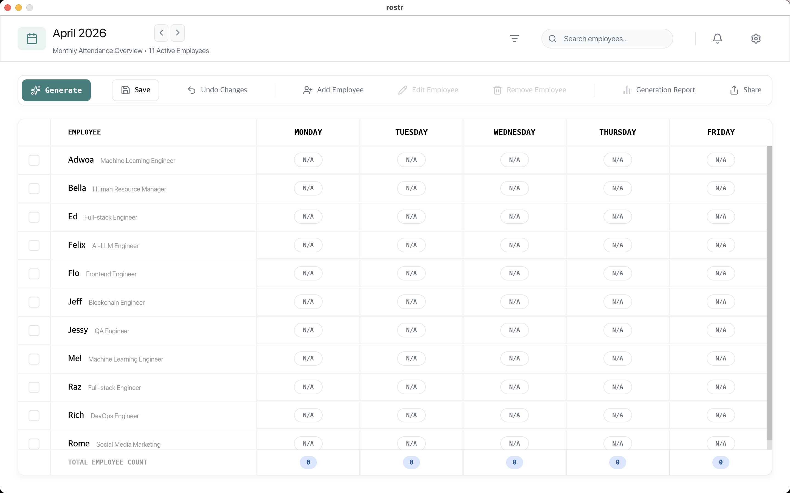
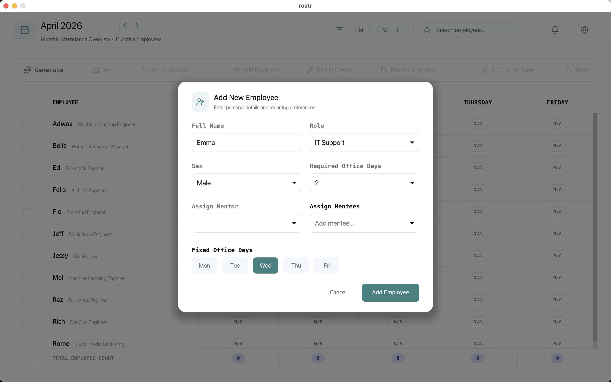
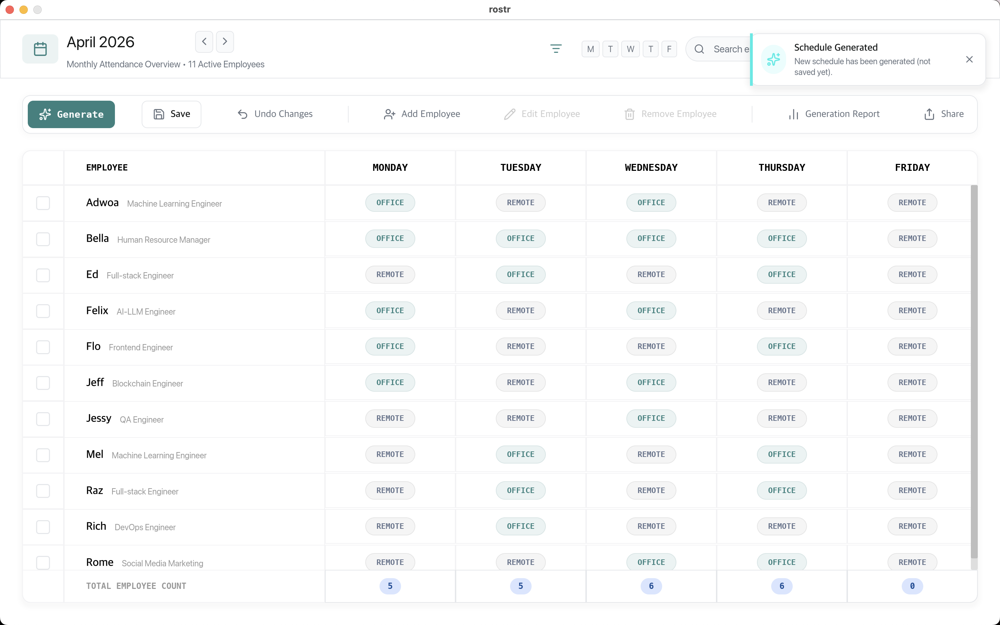
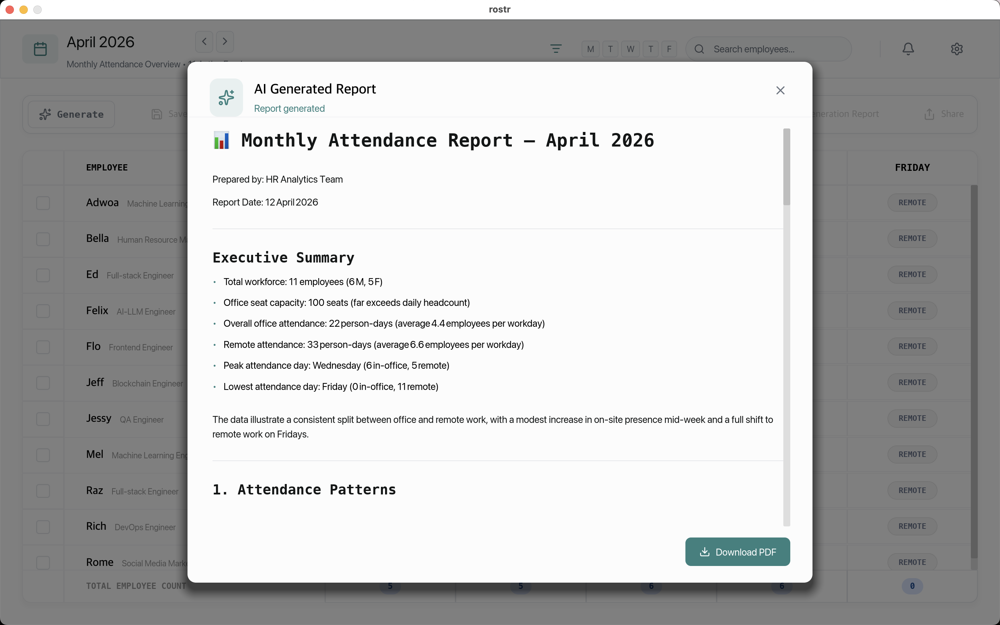
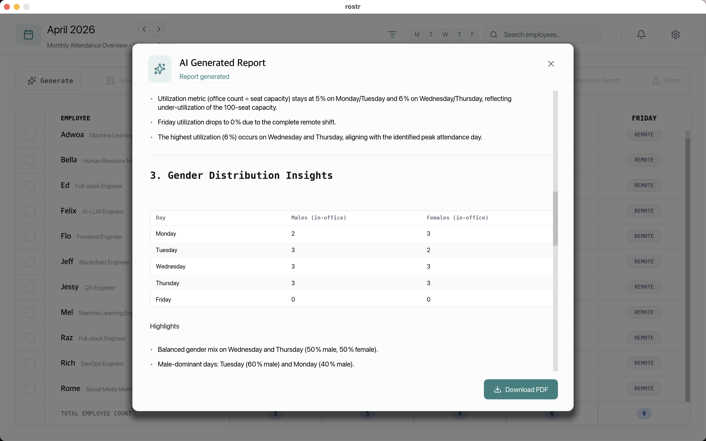
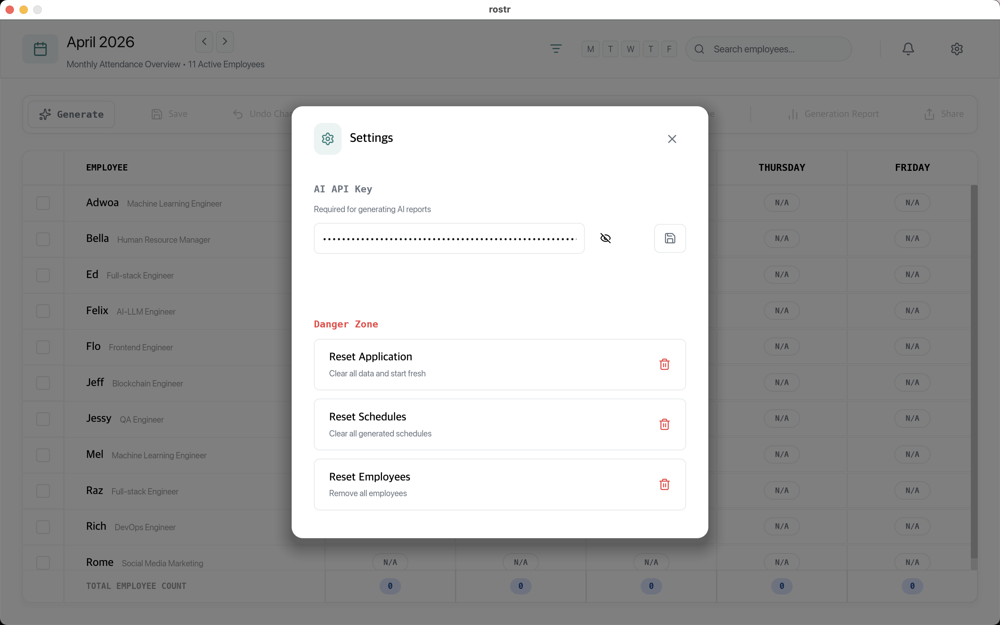
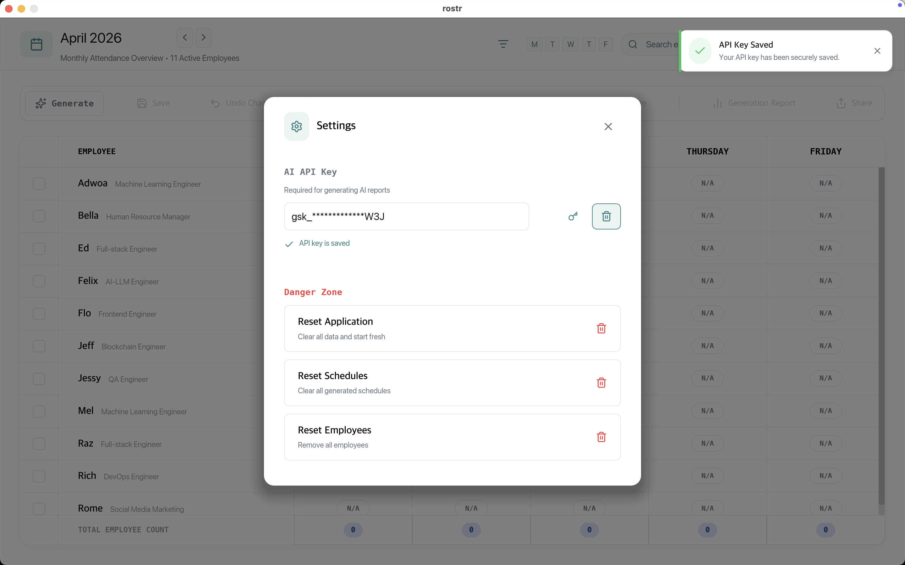
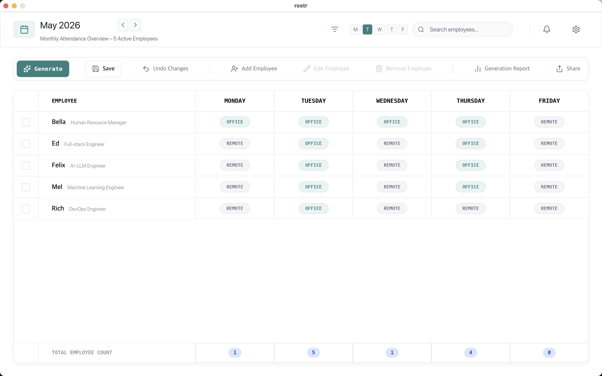
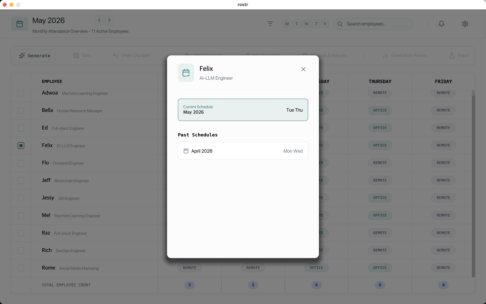

# Rostr - Employee Attendance Schedule Manager

A modern desktop application for managing employee attendance schedules, generating optimized work arrangements, and producing insightful AI-powered reports.



## Table of Contents

- [Goals & Objectives](#goals--objectives)
- [Architecture Overview](#architecture-overview)
- [Technology Stack](#technology-stack)
- [Core Features](#core-features)
- [Design Decisions](#design-decisions)
- [Project Structure](#project-structure)
- [Screenshots](#screenshots)
- [Data Models](#data-models)
- [The Scheduling Engine](#the-scheduling-engine)
- [Security & Storage](#security--storage)
- [Future Improvements](#future-improvements)

---

## Goals & Objectives

Rostr was built to solve a common operational challenge: **optimally distributing employees across office days** while ensuring:

1. **Fair Distribution** - Employees with different required office days (1-4 days per week) get fair and balanced schedules
2. **Mentorship Coordination** - Mentors and mentees can coordinate their office days to overlap for in-person guidance
3. **Fixed Day Preferences** - Employees can specify fixed preferred office days that are always honored
4. **Historical Balance** - The system considers past schedules to avoid repetitive patterns
5. **Actionable Insights** - AI-generated reports provide data-driven analysis of attendance patterns

---

## Architecture Overview

Rostr follows a **layered architecture** with clear separation between:

```
┌─────────────────────────────────────────────────────────────┐
│                     UI Layer (Iced)                         │
│  ┌──────────┐ ┌──────────┐ ┌─────────┐ ┌─────────────────┐  │
│  │ TopBar   │ │ActionBar │ │Table    │ │ Modals          │  │
│  └──────────┘ └──────────┘ └─────────┘ └─────────────────┘  │
└─────────────────────────────────────────────────────────────┘
                            │
                            ▼
┌─────────────────────────────────────────────────────────────┐
│                   Application Layer                         │
│  (main.rs - Message handling, state management)             │
└─────────────────────────────────────────────────────────────┘
                            │
                            ▼
┌─────────────────────────────────────────────────────────────┐
│                    Core Business Logic                      │
│  ┌─────────────┐ ┌─────────────┐ ┌──────────────────────┐   │
│  │ Engine      │ │ LLM Client  │ │ PDF Generator        │   │
│  │ (Scheduler) │ │ (AI Reports)│ │ (Report Export)      │   │
│  └─────────────┘ └─────────────┘ └──────────────────────┘   │
│  ┌─────────────────────────────────────────────────────────┐│
│  │              Models (Employee, Schedule, Types)         ││
│  └─────────────────────────────────────────────────────────┘│
│  ┌───────────────────────────┐ ┌───────────────────────────┐│
│  │ Integrations              │ │ Storage                   ││
│  │ (Excel/CSV/JSON export)   │ │ (SQLite + Repository)     ││
│  └───────────────────────────┘ └───────────────────────────┘│
└─────────────────────────────────────────────────────────────┘
```

### Key Principles

1. **Functional Core, Imperative Shell** - Core logic in pure Rust modules; I/O and UI in outer layers
2. **Repository Pattern** - Data access abstracted through repository traits
3. **Elm-like Architecture** - Unidirectional data flow with a central state machine

---

## Technology Stack

### Core Framework: Iced

Rostr is built using [Iced](https://iced.rs/), a cross-platform GUI library for Rust that emphasizes:

- **Native performance** - Zero dependencies, compiles to native binaries
- **Declarative UI** - Purely functional view functions
- **Great developer experience** - Clear patterns for state management

```toml
iced = { version = "0.14", features = ["canvas", "image", "svg", "advanced", "tokio"] }
```

### Key Dependencies

| Category | Library | Purpose |
|----------|---------|---------|
| **UI** | `iced` | Cross-platform GUI framework |
| **Icons** | `lucide-icons` | Vector icon library |
| **Database** | `rusqlite` | SQLite bindings for persistent storage |
| **Encryption** | `aes-gcm` | AES-256-GCM for API key encryption |
| **HTTP** | `reqwest` | HTTP client for LLM API calls |
| **Excel** | `rust_xlsxwriter` | Excel file generation |
| **PDF** | `printpdf` | PDF document generation |
| **Time** | `chrono` | Date/time handling |
| **Async** | `tokio` | Async runtime |
| **Serialization** | `serde` | Serialization/deserialization |

### Edition

The project uses **Rust Edition 2024** for latest language features.

---

## Core Features

### 1. Employee Management

Rostr provides a comprehensive employee management system with support for:

- **Personal Information**: Name, role, gender
- **Work Preferences**: Required office days per week (1-4 days)
- **Fixed Days**: Specific days that the employee must be in office
- **Mentorship**: Mentor/mentee relationships for coordinating schedules



#### Roles Supported

The system supports 17 different roles:
- HR, AI-LLM Engineer, Social Media Marketing, IT Support
- ML Engineer, Data Scientist, Data Analyst
- Full-stack Engineer, Backend Engineer, Frontend Engineer
- Blockchain Engineer, QA Engineer, Project Manager
- UI/UX Designer, Mobile Engineer, DevOps Engineer, Operations Manager

### 2. Schedule Generation

The scheduling engine (`Engine`) produces optimized monthly schedules by:

1. **Processing Fixed Schedules** - Honoring employees' fixed day preferences first
2. **Prioritizing Mentors** - Mentors are scheduled before mentees
3. **Overlapping Mentors & Mentees** - Scoring algorithm rewards overlapping days
4. **Balancing Load** - Minimizing variance in daily attendance counts
5. **Considering History** - Past schedules influence new assignments



The generator uses pre-computed day combinations:

| Days Required | Valid Combinations |
|---------------|---------------------|
| 1 day | Mon, Tue, Wed, Thu |
| 2 days | Mon-Wed, Mon-Thu, Tue-Thu |
| 3 days | Mon-Tue-Wed, Mon-Tue-Thu, Mon-Wed-Thu, Tue-Wed-Thu |
| 4 days | Mon-Tue-Wed-Thu |

### 3. Interactive Attendance Table

The main interface displays the monthly schedule with:

- **Employee Rows**: Name, role, and attendance status per day
- **Day Columns**: Monday through Friday with status (OFFICE/REMOTE/N/A)
- **Status Toggle**: Click to toggle between OFFICE and REMOTE (when not locked)
- **Selection System**: Click to select an employee (15-second auto-deselect)


### 4. AI-Powered Reports

Using Groq's LLM API, Rostr generates comprehensive markdown reports with:

- **Executive Summary** - Overview of the month's attendance
- **Daily Breakdown** - Office vs Remote percentages per day
- **Gender Distribution** - Male/Female counts by day
- **Role Distribution** - Role counts per day
- **Office Utilization** - Capacity usage metrics



The reports are:
- **Streamed** - Real-time display as AI generates content
- **Exportable** - Download as PDF for sharing



### 5. Data Export

Rostr supports exporting schedules to:
- **Excel (.xlsx)** - Full schedule with employee data
- **PDF** - AI-generated reports

### 6. Settings & API Key Management

Securely store your Groq API key for AI report generation:



Features:
- **Encryption**: API key stored using AES-256-GCM
- **Masking**: Display masked version in UI
- **Toggle Visibility**: Show/hide functionality



---

## Design Decisions

### 1. Why Iced over Tauri/Electron?

Iced provides a **truly native** experience without web technologies:
- No Chromium overhead
- Consistent native window decorations
- Direct Rust code execution
- Better memory characteristics

### 2. SQLite for Storage

SQLite was chosen because:
- **Zero Configuration** - No separate server process
- **File-based** - Database is a single file in `~/.rostr/rostr.db`
- **Mature** - Battle-tested, ACID compliant
- **Sufficient** - Perfect for single-user desktop app

### 3. AES-256-GCM for API Keys

The settings table stores sensitive data encrypted:
- **Authenticated Encryption** - Both confidentiality and integrity
- **Unique Nonces** - Random IV per encryption operation
- **Hardcoded Key** - Fixed 32-byte key (suitable for local desktop app)

### 4. Schedule Locking

When a future schedule exists, the current month becomes read-only:
- Prevents accidental modifications
- Encourages forward planning
- Clear UX state (buttons disabled)

### 5. Hybrid Scheduling Algorithm

The generator uses a **score-based optimization** rather than strict constraints:

```rust
total_score = variance + (3.0 * repetition_score) + mentorship_score
```

This allows:
- **Flexibility** - Better solutions found through randomized exploration
- **Tunable** - Weights can be adjusted for different priorities
- **Greedy** - Fast execution with acceptable results

### 6. UI State Management

The application uses an **Elm-like message system**:
- Central `RostrApp` struct holds all state
- `update()` function processes messages and returns tasks
- `view()` function is purely declarative
- Type-safe message enums prevent runtime errors

---

## Project Structure

```
src/
├── main.rs              # Application entry, message handling, state
├── core/
│   ├── mod.rs           # Core module exports
│   ├── engine/
│   │   ├── mod.rs
│   │   ├── engine.rs    # Main scheduling algorithm
│   │   └── generator.rs # Day combination generation
│   ├── integrations/
│   │   ├── mod.rs
│   │   ├── csv.rs       # CSV import/export
│   │   ├── json.rs      # JSON import/export
│   │   └── excel.rs     # Excel export
│   ├── llm.rs           # Groq API client
│   ├── models/
│   │   ├── mod.rs
│   │   ├── types.rs     # Role, Sex, Weekday enums
│   │   ├── employee.rs  # Employee struct
│   │   ├── schedule.rs  # MonthlySchedule struct
│   │   └── mentorship.rs # Mentorship validation
│   ├── pdf.rs           # PDF generation
│   └── storage/
│       ├── mod.rs
│       ├── database.rs  # SQLite connection management
│       ├── employee_repo.rs
│       └── schedule_repo.rs
└── ui/
    ├── mod.rs           # UI module exports
    ├── action_bar.rs    # Action buttons
    ├── attendance_table.rs # Main data table
    ├── modals.rs        # All modal dialogs
    ├── theme.rs         # Color palette and styles
    ├── toasts.rs        # Notification system
    └── top_bar.rs       # Header with search/filter
```

---

## Screenshots

| Feature | Screenshot |
|---------|------------|
| **Default View** |  |
| **Add Employee** |  |
| **Generation** |  |
| **Filter by Day** |  |
| **Employee Report** |  |
| **Generation Report 1** |  |
| **Generation Report 2** |  |
| **Settings** |  |
| **Settings Key Saved** |  |

---

## Data Models

### Employee

```rust
pub struct Employee {
    pub id: i32,
    pub name: String,
    pub sex: Sex,
    pub role: Role,
    pub required_days: i32,      // 1-4 days per week
    pub fixed_days: Vec<Weekday>, // Pre-assigned office days
    pub is_mentor: bool,         // Has mentees
    pub is_mentee: bool,         // Has a mentor
    pub mentor_id: Option<i32>,  // Reference to mentor
}
```

### MonthlySchedule

```rust
pub struct MonthlySchedule {
    pub year: i32,
    pub month: u32,
    pub schedules: HashMap<Weekday, Vec<Employee>>,
    pub included_employees: Vec<i32>, // All employees for this month
    pub created_at: DateTime<Utc>,
    pub updated_at: DateTime<Utc>,
}
```

### Attendance Status

```rust
pub enum AttendanceStatus {
    Office,  // Scheduled to be in office
    Remote, // Working remotely
    NA,     // Not applicable (no schedule)
}
```

---

## The Scheduling Engine

The `Engine` implements a sophisticated multi-pass algorithm:

### Pass 1: Fixed Schedule Processing
- Iterate all employees
- For employees with `fixed_days`, add them to those days
- Track daily attendance counts

### Pass 2: Mentor Priority
- Group remaining employees by `required_days`
- Extract mentors first
- Process mentors with empty mentor schedule map

### Pass 3: Mentee Processing  
- Build mentor schedule map from Pass 2
- Process mentees with mentor day overlap as a positive signal
- Score formula: `-(matches as f64 * 10.0)`

### Pass 4: Regular Employees
- Remaining employees processed with same logic
- No mentor influence

### Combination Scoring

For each employee, evaluate all valid day combinations:

1. **Variance Score**: How even is the distribution?
2. **Repetition Score**: How many days match recent history?
3. **Mentorship Score**: Does this align with mentor/mentee?

Select the combination with the **lowest total score**.

---

## Security & Storage

### Database Location

All data is stored in `~/.rostr/rostr.db`:
- Employee records
- Historical schedules
- Encrypted API key

### API Key Encryption

The API key is encrypted before storage:

```rust
const ENCRYPTION_KEY: &[u8; 32] = b"rostr_secure_key_32_bytes_long_!";

fn encrypt(&self, plaintext: &str) -> Result<String, String> {
    let cipher = Aes256Gcm::new_from_slice(ENCRYPTION_KEY)?;
    let nonce: [u8; 12] = rand::random();
    let ciphertext = cipher.encrypt(nonce, plaintext.as_bytes())?;
    // Store nonce + ciphertext
}
```

---

## Future Improvements

### 1. Notification Support

Currently, Rostr relies on toast notifications for feedback. Future enhancements:

- **Desktop Notifications**: Native OS notifications for:
  - Schedule generation complete
  - Export finished
  - Reminders for unsaved schedules
- **In-app Notification Center**: Persistent notification log

### 2. Make Resizable & Improve Responsiveness

Currently, the window is fixed at maximized size. Planned improvements:

- **Minimum Window Size**: Set reasonable minimum (1024x768)
- **Responsive Layout**:
  - Table columns shrink/grow with window
  - Modal sizes adjust to content
  - Action bar wraps on smaller windows
- **Dynamic Grid**: Use percentage-based layouts

### 3. Auto-Updating

Single-user desktop apps benefit from seamless updates:

- **Update Check**: On startup, check for new version
- **Background Download**: Fetch update without blocking UI
- **Install on Restart**: Apply update on next launch
- **Changelog Display**: Show what's new before updating

---

## Building & Running

### Prerequisites

- Rust 1.75+ (for Edition 2024)
- Cargo

### Build

```bash
cargo build --release
```

### Run

```bash
cargo run
```

### Environment Variables

Create a `.env` file for API key:

```
GROQ_API_KEY=your_api_key_here
```

Or use the in-app Settings to enter your key (it will be encrypted).

---

## License

This project is free and open source software, licensed under the MIT License.
